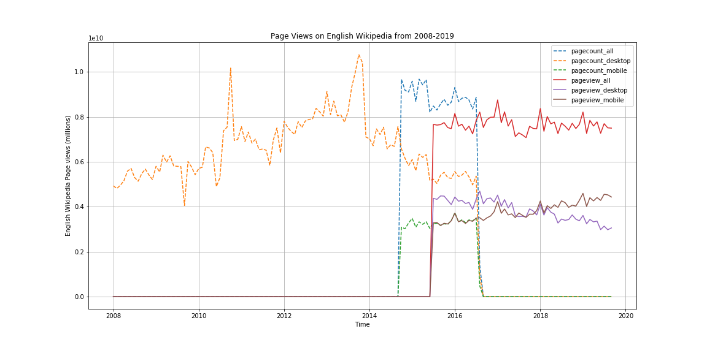

## A1: Data Curation

The goal of this project is to construct, analyze and publish a dataset of monthly traffic on English Wikipedia from January 1st 2008 to August 30 2019. 
The project aims to follow the best practices for conducting open scientific research focussing on repoducibility.

The project documents the following steps in this [IPython notebook](./data-512-a1/hcds-a1-data-curation.ipynb) 
1) Data Acquisition
2) Data Processing
3) Data Analysis


### Folder Structure

```
.
├── README.md
├── data
│   ├── clean
│   │   └── en-wikipedia_traffic_200801-201809.csv
│   └── raw
│       ├── pagecounts_desktop-site_200801-201909.json
│       ├── pagecounts_mobile-site_200801-201909.json
│       ├── pageviews_desktop-site_200801-201909.json
│       ├── pageviews_mobile-app_200801-201909.json
│       └── pageviews_mobile-site_200801-201909.json
└── hcds-a1-data-curation.ipynb
```

All the raw data is stored under [data/raw](./data/raw) and the cleaned data in stored under [data/clean](./data/clean)
Analysis is done in data-512-a1/hcds-a1-data-curation.ipynb notebook 

### Data

#### Source
The data is collected from Wikimedia REST API's. 
1) The Legacy Pagecounts API ([documentation](https://wikitech.wikimedia.org/wiki/Analytics/AQS/Legacy_Pagecounts), [endpoint](https://wikimedia.org/api/rest_v1/#!/Pagecounts_data_(legacy)/get_metrics_legacy_pagecounts_aggregate_project_access_site_granularity_start_end)) provides access to desktop and mobile traffic data from December 2007 through July 2016.

2) The Pageviews API ([documentation](https://wikitech.wikimedia.org/wiki/Analytics/AQS/Pageviews), [endpoint](https://wikimedia.org/api/rest_v1/#!/Pageviews_data/get_metrics_pageviews_aggregate_project_access_agent_granularity_start_end)) provides access to desktop, mobile web, and mobile app traffic data from July 2015 through last month.


### Data Decription

The final cleaned data is stored in data/clean/<filename>
The columns in the file represent the following
  
  | Column  | Value | Description|
|--------------|-------------|---------------|
| year | yyyy | specific Year of a record in yyyy format |
| month | mm | specific Month of a record in mm format |
| pagecount_all_views | num_views |  The total number of pagecounts (mobile + web)|
| pagecount_desktop_views | num_views | Number of desktop pagecounts |
| pagecount_mobile_views | num_views | Number of mobile pagecounts|
| pageview_all_views | num_views | The total number of pageviews |
| pageview_mobile_views | num_views | Number of mobile (mobile-app + mobile-web) pageviews|
| pageview_desktop_views | num_views | Number of desktop pageviews |

### Methodology

#### Data Acquisition
Data is collected by making API requests to Wikimedia endpoints and storing this JSON information files. Data is collected separately for desktop and mobile views

#### Data Processing
As part of the processing steps the desktop and mobile views are combined to get the total number of views for both Pagecounts and Pageviews. Data is merged from all the sources and combined into a final file as described above

#### Data Analysis
To analyse the data, we are plotting a line graph from January 1st 2008 to August 30 2019 with different lines and colors representing the number of views


  
To perform the above steps the following Python libraries were used
1) requests - To perform API requests
2) pandas - Python data processing library
3) matplotlib - Data plotting tool 


### Data Caveats

The legacy API doesn't differentiate between organic traffic and others (web crawlers). The number of pageviews may be inflated.

### License and Terms of Use

Wikimedia [Terms of Use](https://www.mediawiki.org/wiki/REST_API#Terms_and_conditions)

The code is available under [MIT License](../LICENSE)

