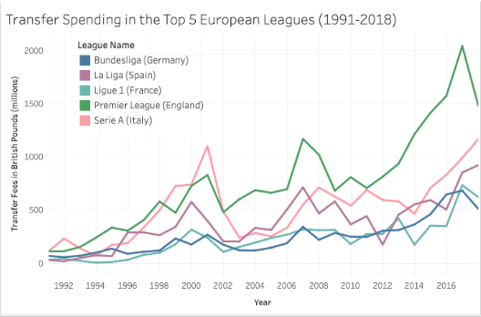
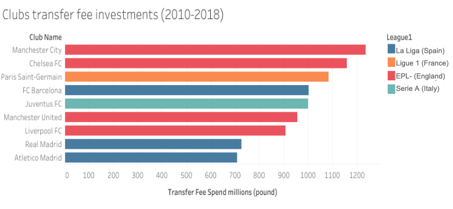
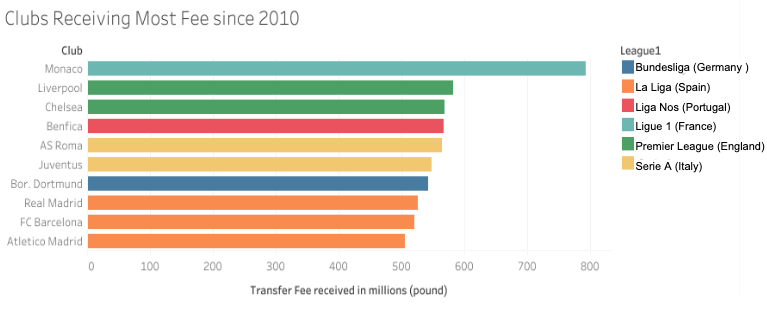
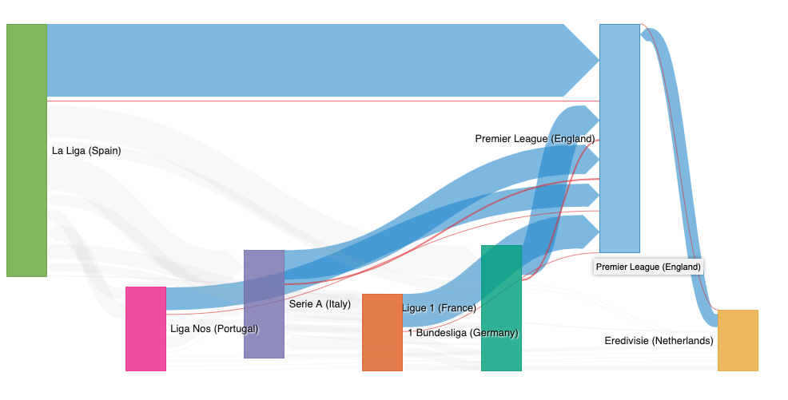
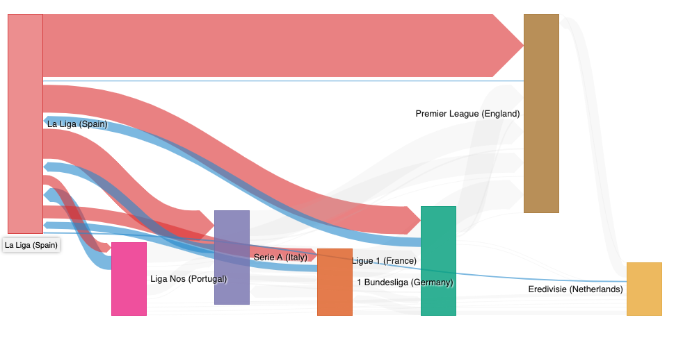
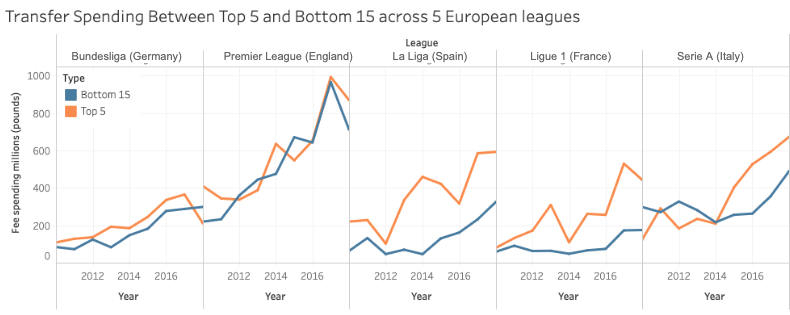
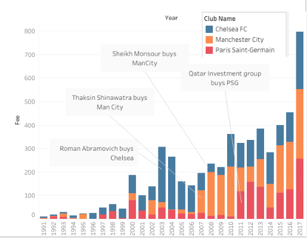

# FIFA Transfer Market Analysis of European Football Leagues
## Data 512 Project
## Tharun Sikhinam

## I. Introduction

Transfer windows are as busy a time as any other in the football world. The game attracts so much attention that even when the ball is not rolling, the eyes of the entire world are on football. Transfers occur all year round and in every corner of the globe, but activity on the transfer market is typically at its peak during the summer and winter season.

The purpose of this project is to study of the economics in play from 1990 - 2019 in the transfer market of the top european leagues. It would be interesting to know how the trends have changed over the years. And by looking closely at the data, one hopes to uncover any hidden trends and explain the rise of the elite clubs in the European continent. With each clubs bringing in vast amounts of money through TV rights and other sources, it would be interesting to know how the clubs have put this money to use.

Understanding these macroeconomics can help us build a fair game and find areas of improvement. Through this analysis we want to address the wealth inequality of the top elite european clubs and how football has almost become a ‘money-game’. 

## II. Background

The best resource for transfmer markets is the official FIFA TMS[1]. This link holds a summary reports for each transfer window in the european leagues dating back to 2013. The analysis concentrates on a particular transfer window and not the trends over the years. While the report talks about how each country is represented, the players are not classified on their Position (Striker, Midfield etc.,) Through this analysis we wish to answer questions such as "Which country produces the best strikers?"

KPMG also publishes reports on clubs valuations and their spendings[2]. These reports also serve as useful guidelines so that I don't replicate any existing work. Most of these papers focus on a short duration of time, and this motivated me to explore the trends dating back to 1990 and correlating some of the trends found to real-life events.

The wealth gap between the top clubs and lower level clubs has been evident for a while [3], but it would be intersting to know what the exact numbers are. And how this wealth gap has been changing over the years. This can inform football policy makers to design better laws to safeguard the values and spirit of the game.

## III. Data

All the rawData collected for the analysis is stored in [rawData](./rawData) folder

The cleanData is stored in [cleanData](./cleanData) folder

The data for this analysis is scraped off of transfermarkt.co.uk
The scraping was done in accordance with the Terms of Use in this link: https://www.transfermarkt.co.uk/intern/anb After reading the Terms of Use, it clearly states that

```4.8. With the transmission of Content, Transfermarkt grants you the irrevocable, temporally and spatially unlimited and transferable right to reproduce, distribute, publish, issue, make publicly accessible, modify, translate and store the Content. This includes the right to edit, design, adapt to the file formats required for use, and to change and / or improve the presentation quality.```

Furthermore looking at the https://www.transfermarkt.co.uk/robots.txt , the pages we want to scrap off of are not disallowed and are open to web crawlers and scrapers.

This dataset consists of all transfers in the European football market from 1991-2018. The data consists of a player name, club-out, club-in along with the transfer value grouped by different leagues. The dataset also consists of free transfers and loans as well. Most of the data is updated and contributed by the users of the website, and there might be few factual inaccuracies in the transfer figures stated.

<b>Ethical considerations:</b> Player names and ages have been removed from the dataset and will not be used as part of the analysis. This analysis doesn't aim to disrespect any player or country. The results of the analysis are aimed at the governing bodies of different leagues and sport lawmakers. Individual clubs are singled out over the analysis.

## IV. Folder structure
```
.
├── A4_Project_Proposal.md
├── A5_Project_Plan.md
├── Data-512-Analysis.ipynb
├── README.md
├── cleanData
│   ├── allSeasons.csv
│   ├── allSeasonsClean.csv
│   ├── inflation.csv
│   └── transfers.db
├── images
│   ├── q1.png
│   ├── q21.png
│   ├── q22.png
│   ├── q31.png
│   ├── q32.png
│   ├── q4.png
│   ├── q5Viz.twbx
│   └── q5.png
├── rawData
│   └── {league_name}_{year}.csv     
└── scrapingScripts
    ├── 00-setup.R
    └── 01-scrape.R
```
Scripts to scrape raw data from website is stored in [scrapingScripts](./scrapingScripts). These are written in R and required an R distribution to run the file.

All the raw data is stored under [rawData](./rawData) where the file format is {league_name}_{year}.csv and the cleaned data in stored under [cleanData](./cleanData)   
[allSeasons](./cleanData/allSeasons.csv) hold's unadjusted transfer values   
[allSeasonsClean](./cleanData/allSeasonsClean.csv) the transfer fees are adjusted for inflation   
[transfers.db](./cleanData/transfers.db) Sqlite3 database dump of all the tables used for the analysis. (use this file if you want to skip data collection and pre-processing steps)

Analysis is done in [Data-512-Analysis.ipynb](./Data-512-Analysis.ipynb)

## IV. Research Questions

Data collection and analysis procedure is recorded in this [IPython Notebook](./Data-512-Analysis.ipynb)

### <b>Q1. How has the transfer spending increased in the top 5 European Leagues?</b>

### Results
- Transfer spending has been steadily increasing for all European leagues since 1991
- The spending gap between Premier League and the others  shows a steep increase since the 2010.
- The percentage change in median price of player from 1990’s to 2018 is 521%
- The rise TV rights revenue can be an explanation for the rise in Premier League Transfer Spending (https://www.usatoday.com/story/sports/soccer/2019/05/21/english-premier-league-broadcast-rights-rise-to-12-billion/39500789/) 
###  <b>Q2. Which clubs spent the most and received the most transfer fee on players from 2010-2018?</b>
Which clubs spent the most on players from 2010-2018?
   


Which clubs received the highest transfer fees on players from 2010-2018?


### Results
- The highest spending clubs are Manchester City, Chelsea and PSG. It would be interesting to know how the transfer trends have changed for these three clubs (explored in q5)
- The club with highest transfer fees received is Monaco a relatively small club from Ligue 1 (France). We also notice Benfica another club from Liga Nos (Portugal) that receives high transfer fees. This goes to show that the club spending the highest doesn't necessarily sell their players for a high value
- 4 of the top 10 highest spending clubs are from the English Premier League, which leads us into the next question.

### <b> Q3. How have transfers fees moved betwen the leagues from 2010-2018? </b> . 
League with highest imports - Premier League (England)
 
  
  
League with highest exports - La Liga (Spain)

### Results
- The league importing the maximum talent is the English Premier League. This also explains the high transfer spending in that league.
- The league exporting most talent is La Liga (Spain). The Spanish League exports players to nearly all leagues with the highest being to English Premier League.  

### <b> Q4. How has the wealth gap changed amongst the European elite? </b>

### Results
- We observe a huge wealth inequality between the top and bottom clubs in Ligue 1, Serie A and Primera Division
- The difference is not so significant for English Premier League and the Bundesliga
- This is still a cause for concern since the top 5 clubs hold a disproportionate share of wealth in the top flight clubs
- These top 5 clubs in their respective leagues have won the domestic or international titles since 2010 (except for Leicester City in 2016).
- High transfer spending for domestic and international performance can lead to inequality between leagues and clubs. 
### <b> Q5. Investigating the spending trends of Manchester City, Chelsea and Paris Saint-Germain </b>

### Results
- Chelsea, Manchester City and PSG have challenged the European elite in the past decade partly due to their huge spending
- Chelsea’s investment grew by over 234%, while Paris Saint Germain’s by 477% and Manchester City’s by 621% 
- The huge transfer spendings can be attributed to the massive amounts of foreign investment into clubs

<b>Amount & time to first title</b>
- Chelsea - £470.5 million (2 yrs)
- Manchester City - £761 million (5 yrs)
- Paris SaintGermain - £421 million  (2 ys)

## V. Limitations
- All of the data is collected and maintained by users of the transfermarkt.co.uk website. There might be inaccuracies in the stated transfer figures. 
- These inaccuracies might be more frequent as we go back the years (1990-2000)
- As part of the analysis players on loan and free transfers are not being considered, this could change the results of the analysis

## VI. Conclusion

- By analyzing the transfer market we are now aware of some of the big spenders in the European leagues and the hyper-inflation in transfer fees in the English Premier League

- With clubs raking in huge amounts of revenue, checks and balances need to be put into place to prevent the sport from being dominated from a few European elite clubs. which could lead to an European Super League

- High transfer spending for domestic and international performance can lead to wealth inequality between leagues and clubs. 

- The increase in foreign investments into European Clubs has led to the rise of super-rich clubs

- Clubs chasing success are spending more and more on players, which creates an unequal playing field for all the clubs. Although, it might not be feasible to completely curb the spending of these clubs, regulations need to be put in place to prevent such clubs from taking over.

## VII. References
1. FIFA TMS reports https://www.fifatms.com/data-reports/reports/
2. Evaluation football clubs in Europe - A report by KPMG https://www.footballbenchmark.com/library/football_clubs_valuation_the_european_elite_2019
3. Wealth gap in the top European Clubs https://www.usatoday.com/story/sports/soccer/2018/01/16/uefa-warns-of-growing-wealth-gap-in-top-clubs-finance-study/109521284/
4. British Inflation Calculator http://inflation.iamkate.com/


